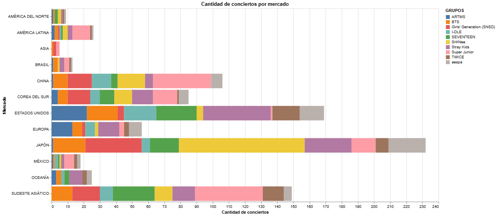

# __El K-POP y Japón: El mercado más explorado__ 

El K-POP, tal como dice su nombre, es un género de música que surge desde Corea del Sur (*“Korean Pop [Pop Coreano]”*). ¿Pero es realmente Corea el público más explorado por el género en temas de concierto? 

Como muestran los datos, Japón resulta ser el mercado con más conciertos de K-POP registrados, lo que demuestra que es uno de los mercados más tentadores para visitar por los grupos de las diversas generaciones. ¿Pero qué lo hace atractivo para que los grupos vuelvan a visitar? 

Según datos de la [Federación Internacional de la Industria Fonográfica](https://www.ifpi.org), Japón ha ocupado en los últimos años el segundo lugar en tamaño de mercado, solo detrás de Estados Unidos. ¿Pero por qué entonces no es Estados Unidos el mercado con más conciertos, sino el segundo? 

Eso se debe a la proximidad geográfica. Mientras que los grupos tienen que viajar casi diez mil kilómetros para llegar al país norteamericano, considerando precios más elevados de pasajes y más tiempo de traslado, Japón les queda “al lado”, lo que resulta más económico y conlleva menos tiempo “perdido” en traslado. Además, al ser países más próximos geográficamente hablando, hay más cantidad de vuelos diarios. 

Otra cosa que hace que la industria ponga sus ojos en Japón es que es uno de los pocos países donde el formato físico (CDs, DVDs, Blu-ray) sigue siendo un formato dominante. Según cifras de [*Recording Industry Association of Japan (RIAJ)*](https://www.riaj.or.jp/f/e/leg/faq/) las ventas anuales físicas son muy altas y, al K-POP vender mucho lo físico (con diversas versiones de álbumes, *photocards*, etc) resulta ser algo muy positivo. 

También las *fanbases* (base de fans) japonesas son conocidas por ser extremadamente leales y dedicadas, mostrando un apoyo incondicional a los grupos que siguen, incluso en momentos difíciles (como *hiatus* [pausa de actividades] y escándalos) o cuando ya no son una “moda” (Ejemplo: en Estados Unidos pasa mucho que se siguen grupos más por moda que por gusto, las personas perdiendo el interés una vez ya no son tendencia, a diferencia de Japón que siguen ahí mostrando su apoyo). 

Los grupos de K-POP han utilizado la técnica de adaptar sus canciones al japonés para adentrarse en el mercado de forma más rápida, pero posteriormente han comenzado a crear canciones originales en el idioma, lo que también genera cierta cercanía con el público de dicho país. 

## *__¿Y Latinoamérica?__* 

Lamentablemente para muchos fans latinoamericanos, los grupos de K-POP aún no han explorado demasiado este mercado, a diferencia de otros como China y Europa.  

Si antes hablábamos de lejanía con Estados Unidos, resulta un mercado mucho más lejano Latinoamérica, por lo que los riesgos de acercarse a esta parte del mundo son altos al considerar temas de costo y tiempo de viaje. 

A pesar de eso, no es el mercado menos explorado, como resultan ciertos países asiáticos como Arabia Saudita y Emiratos Árabes. Esto podría deberse a ciertas restricciones legales y culturales, además de su situación política y geográfica que hacen que sean países más lejanos, pero también influencia el que sea un mercado mucho más pequeño en comparación al resto de mercados. 

 