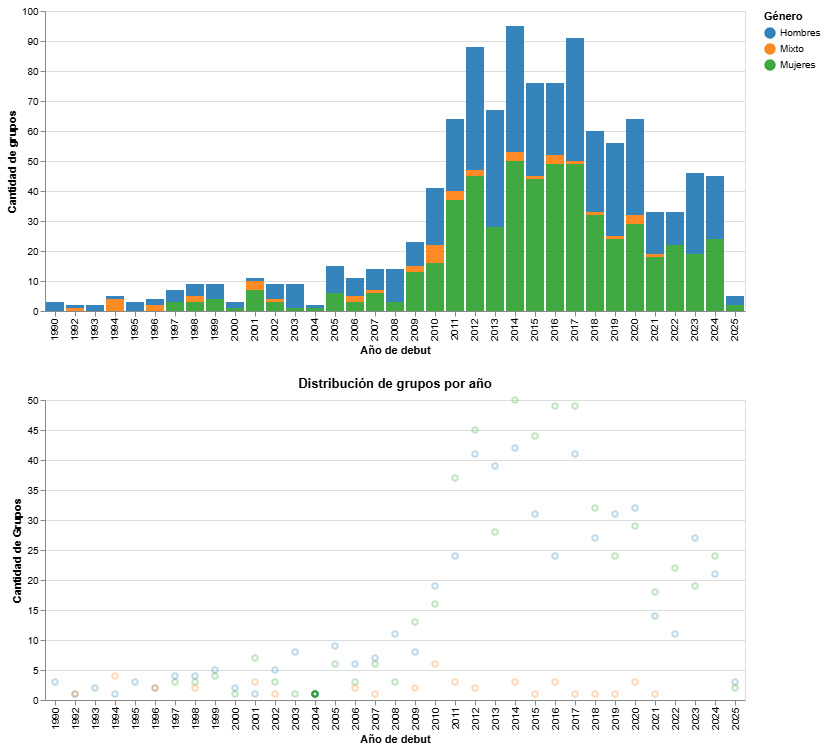

# El auge del Kpop: los grupos masculinos y femeninos en aumento, mientras los mixtos nos dicen adiós 

*Hoy podemos afirmar que el Kpop dejó de ser un “simple fenómeno” o una moda pasajera, sino que en un poco más de 35 años ha conseguido una expansión a nivel global, trascendiendo fronteras e idiomas, para convertirse en una industria musical consolidada pero que también ha influido en aspectos culturales, sociales y económicos para Corea del Sur.*

## Pero ¿cómo fue el inicio del Kpop? 
En los años noventa, el Kpop daba sus primeros pasos al debutar en 1990 a los primeros tres grupos (Hyun Jin-Young & Wawa, Yacha, Light and Salt), todos masculinos. Entre 1990 y 1999, predominaban los grupos masculinos, con un crecimiento moderado, solo hacia finales de la década debutaron en un mismo año cinco grupos. 

Durante este mismo periodo, los grupos mixtos también intentaban abrirse paso en esta industria, aunque su presencia no representaba un peso ante los grupos masculinos. Habiendo años, en los que no debutaba ninguno. 

A través esta visualización (histograma) podemos interpretar que, en esos años, hay pocos grupos con una baja diversidad. Recién en 1997 debutaron los primeros tres grupos femeninos de esta industria. Con esta información podemos intuir que se trataba de una industria incipiente, y que estaba dando sus primeros pasos para convertirse en lo que conocemos en la actualidad.

## Década de los 2000 y el despegue femenino 
Con el inicio de una década, la visualización comienza a mostrarnos un aumento en el número de grupos que debutaban por año. Pero a partir de 2009 es cuando el Kpop comienza su *boom explosivo*, el cual se ha mantenido dentro de todo, constante. Es en este período cuando los grupos femeninos comienzan a igualar, e incluso superar en ciertos años, a sus pares masculinos. Pero el año que marcó la mayor cantidad de debuts de grupos femeninos fue en 2014 donde se registraron 50. 

También, los grupos mixtos, continuaron presentes durante esos años, pero a diferencia de sus pares, su peak de debuts fue seis grupos en 2010. Mientras que, en ese mismo año, surgieron 16 grupos femeninos y 19 masculinos. 

Tomando en consideración el contexto, este crecimiento no es casual. Sino que coincide con el comienzo de globalización del Kpop a raíz del auge y popularización de plataformas como YouTube, y la consolidación de las Big Three (SM, YG y JYP). 

## Actualidad: ¿saturación o reinvención? 
A través de esta visualización podemos ver que los años de *boom* fueron en 2016 y 2017 (con casi 100 grupos debutando por año contamos femeninos, masculinos y mixtos), aunque también podemos ver una pequeña baja entre 2018-2022, aunque podemos atribuirlo a la época de pandemia, y quien sabe, quizás una posible saturación por parte del público. Pero en 2023 y 2024 hay una leve alza (pero no alcanza los años *boom* que ya mencioné). 

## Conclusiones 
Luego de este breve repaso por el histograma y los datos que nos muestra, podemos visualizar y afirmar que a partir de la segunda generación sí hay un aumento en el número de grupos como una respuesta a la demanda o misma ambición (lo cual no es malo) de las empresas por alcanzar mercados internacionales, como planteamos en grupo con nuestra hipótesis. 
Si bien, este es un análisis inspirado en las preguntas que me planteé en la entrega 2, no es el único posible de realizar con los datos. Algunas ideas que vienen a mí, y se podrían explorar con el tiempo podrían ser: 
•	¿Por qué en 2014 fue el peak de debuts femeninos? 
•	La pandemia y sus efectos: ¿recién están comenzado a retomar el ritmo en debuts por año? 
•	¿El Kpop tiene ciclos de auge y caídas? ¿Cada cuántos años se da este patrón? 
